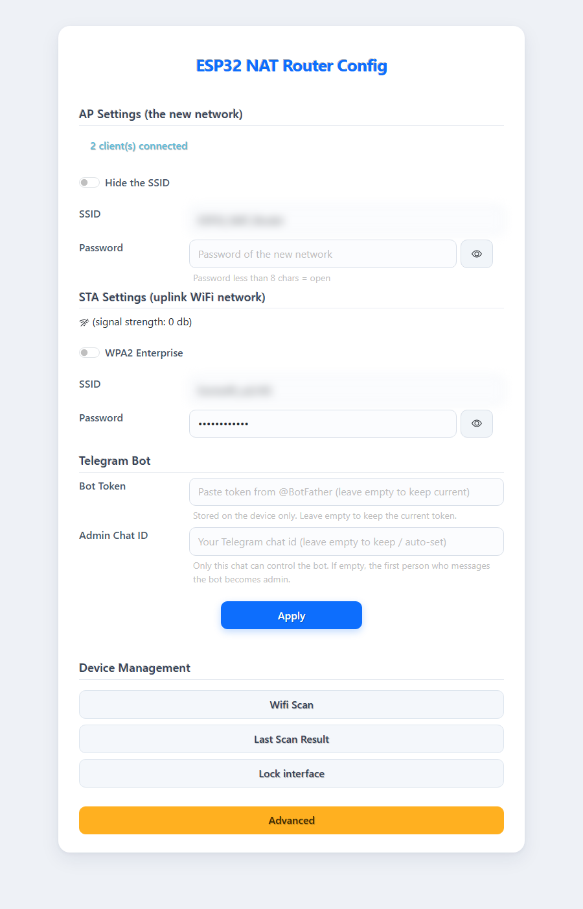
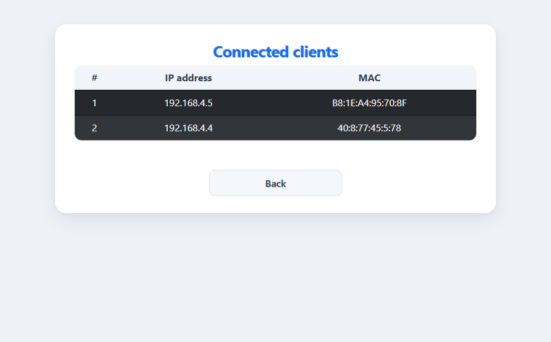
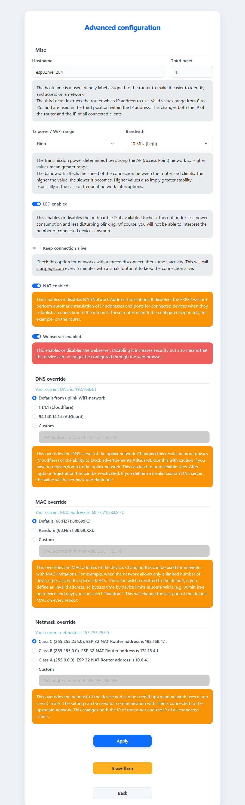

# ESP32 NAT Router with Telegram Control & Content Filtering

Turn an **ESP32** into a WiFi **NAT router / range extender** that you control remotely from a
**Telegram bot**. It repeats an existing WiFi network into its own access point, forwards traffic
with NAT, and lets an admin block domains, whitelist devices, and watch connected clients — all
from Telegram or a simple web panel.

## Screenshots

**Web configuration** (`http://192.168.4.1`)



**Connected clients**



**Advanced settings**



## Features

- **WiFi NAT router / repeater** – extend an existing WiFi network with its own SSID
- **Web configuration UI** at `http://192.168.4.1` (mobile friendly, light theme)
- **Telegram bot control**
  - List connected clients (vendor, IP, MAC)
  - Whitelist / block devices by MAC
  - Block / unblock domains
  - Get notified when a device connects or hits a blocked site
- **DNS domain blocking** – local blocklist, persisted to flash (NVS)
- **MAC whitelist** – restrict which devices may connect
- **Admin protection** – only the configured Telegram chat can control the bot
- **No secrets in the source** – the bot token is stored on the device, not in the code

## Hardware

- A classic **ESP32** board (e.g. `esp32dev`), 4 MB flash
- 2.4 GHz WiFi only (ESP32 has no 5 GHz)
- A USB cable to your computer

---

## 1. Install PlatformIO

This project is built with **PlatformIO** (ESP-IDF framework). The easiest way is the VS Code extension:

1. Install [Visual Studio Code](https://code.visualstudio.com/).
2. Open the **Extensions** panel (`Ctrl+Shift+X`), search **"PlatformIO IDE"**, and install it.
3. Restart VS Code. Wait for PlatformIO to finish its first-time setup (bottom status bar).

*(CLI alternative: `pip install platformio`, then use the `pio` commands below.)*

## 2. Get the project

```bash
git clone https://github.com/MahmudjonA/esp32_nat_router.git
cd esp32_nat_router
```

Everything needed (including the Telegram library and its CA certificate) is included — no submodule setup required.

## 3. Open, Build & Flash

**In VS Code:**

1. **File → Open Folder** and select the project folder.

   

2. Open the **PlatformIO** sidebar and expand **Project Tasks → esp32**.

   

3. Click **Build** to compile.

   

4. Connect the ESP32 over USB and click **Upload**.
5. Click **Monitor** to see the serial log (115200 baud).

**From the terminal:**

```bash
pio run                    # build
pio run --target upload    # flash (ESP32 connected over USB)
pio device monitor -b 115200   # serial log
```

> **Build fails with `pip._internal.utils.inject_securetransport`?**
> The ESP-IDF Python environment has a broken pip. Fix it:
> ```bash
> "$HOME/.platformio/penv/.espidf-5.1.2/Scripts/python.exe" -m ensurepip --upgrade
> ```
> or delete `~/.platformio/penv/.espidf-5.1.2` and let PlatformIO recreate it.

---

## 4. First-time Setup

1. After flashing, the ESP32 creates an open WiFi network named **`ESP32_NAT_Router`**.
2. Connect to it and open **`http://192.168.4.1`**.
3. **STA Settings** – enter your existing WiFi (uplink) **SSID** and **password**.
4. **AP Settings** *(optional)* – set your own SSID/password for the new network.
5. **Telegram Bot** *(optional)* – paste your **Bot Token** (see below).
6. Click **Apply**. The device reboots and connects to your uplink — NAT is now active.

## 5. Telegram Bot

1. Create a bot with [@BotFather](https://t.me/BotFather) and copy its **token**.
2. Paste the token in the web panel (**Telegram Bot → Bot Token**) and **Apply**.
3. Message your bot once. If no admin is set yet, **the first person to message becomes the admin**
   (saved on the device). Only the admin can run commands.
4. To pin the admin explicitly: message the bot — it replies with your **chat id** — then enter that
   id under **Telegram Bot → Admin Chat ID**.

### Commands

| Command | Description |
|---------|-------------|
| `/ping` | Health check (replies `pong`) |
| `/clients` | List connected devices (vendor, IP, MAC) |
| `/allow AA:BB:CC:DD:EE:FF` | Add a MAC to the whitelist |
| `/block AA:BB:CC:DD:EE:FF` | Remove a MAC from the whitelist |
| `/list` | Number of whitelisted MACs |
| `/clear` | Disable the whitelist (allow all) |
| `/blockdomain example.com` | Block a domain and its subdomains |
| `/undomain example.com` | Unblock a domain |
| `/domains` | List blocked domains |

The admin is notified when a device connects (allowed/blocked) and when a device hits a blocked
site (rate-limited to avoid spam).

## 6. Web Interface

- **AP / STA settings**, **Telegram Bot** (token + admin), **Apply**
- **Device Management**: Wifi Scan, Last Scan Result, Lock interface, Advanced
- **Clients**: connected devices with IP and MAC
- **Advanced**: NAT on/off, WiFi tx power, DNS override, MAC override, netmask, hostname, LED,
  keep-alive, and **device reset** (erase all settings)

## How the filters work

- **MAC whitelist** – empty = everyone allowed. After the first `/allow`, whitelist mode turns on
  and non-whitelisted devices are disconnected (the bot warns you which). Send `/clear` from
  Telegram to turn it off and restore full access.
- **Domain blocking** – matches the exact domain and its subdomains: blocking `example.com`
  blocks `example.com` and `www.example.com`, but not `notexample.com`.

## Limitations

- **Encrypted DNS (DoH/DoT) bypasses domain blocking.** Clients using DNS-over-HTTPS (Chrome,
  Firefox, iOS/Android "Private DNS") don't query the router's DNS. Disable secure DNS on the
  client for filtering to work.
- **MAC randomization** – modern phones use random MACs by default (shown as `Private/Random`),
  which makes vendor detection and MAC whitelisting unreliable. Disable "Private WiFi address" on
  the client for a stable MAC.
- **A full flash erase wipes all settings** (token, admin, WiFi, blocklists) — re-enter them after
  `erase_flash` (not needed after a normal reflash).
- **Scanning** briefly interrupts the AP for a few seconds.
- Built for the classic **ESP32** (`esp32dev`) only.

## Credits

- [dchristl/esp32_nat_router_extended](https://github.com/dchristl/esp32_nat_router_extended)
- [martin-ger/esp32_nat_router](https://github.com/martin-ger/esp32_nat_router)
- [uTLGBotLib](https://github.com/J-Rios/uTLGBotLib) — Telegram bot library
